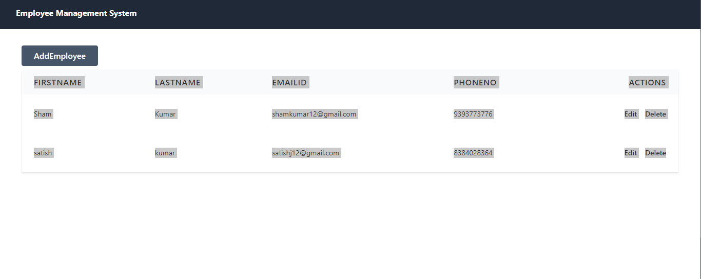
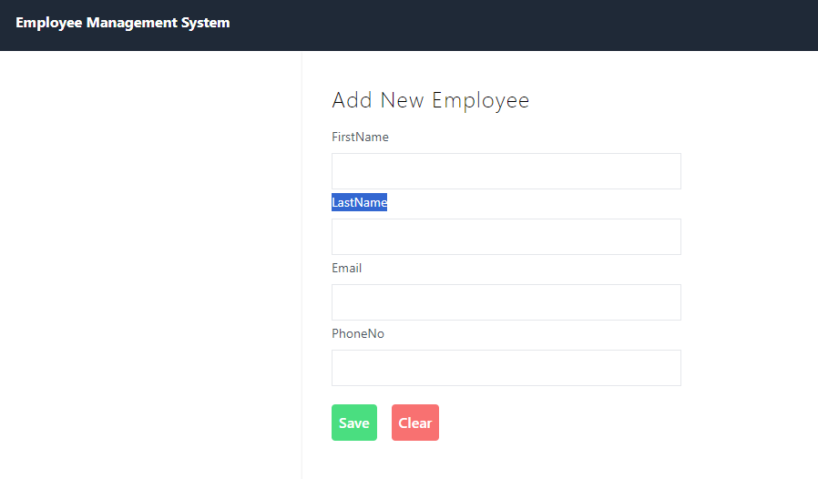
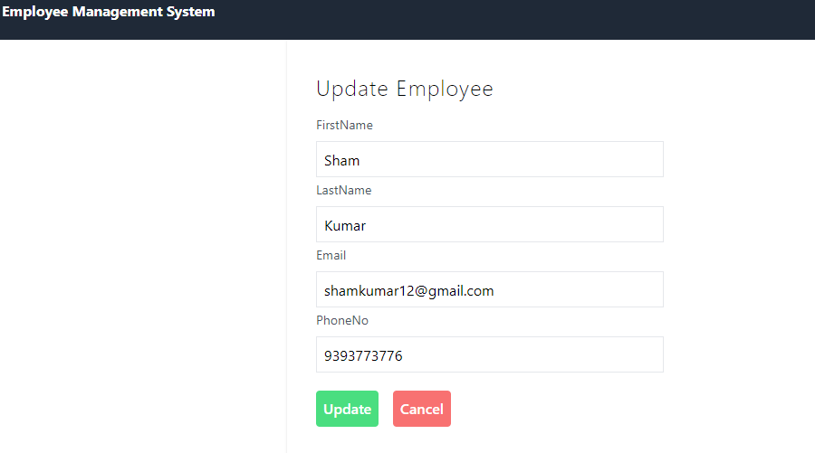
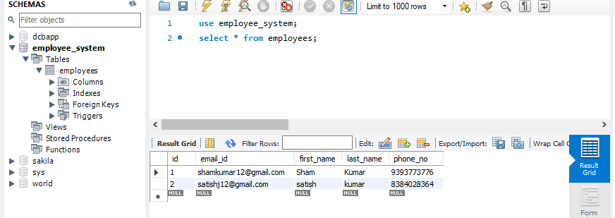

# Employee Management System

The Employee Management System (EMS) is designed to help organizations manage their employee data efficiently. The system allows users to add, update, delete and view employee information seamlessly. Below is an overview of the system's main pages.

## Homepage
The homepage of the EMS provides an overview of the system. It displays a list of all employees and provides navigation options to add new employees or update or delete existing employee details.

## Add Employee Page
The Add Employee page allows users to input new employee information. The form includes fields such as name, department, position, and contact details.

## Update Employee Page
The Update Employee page allows users to modify existing employee information. Users can search for an employee by their ID or name and update their details as needed.

##Persistent Storage
MySQL table used to store the employee details

